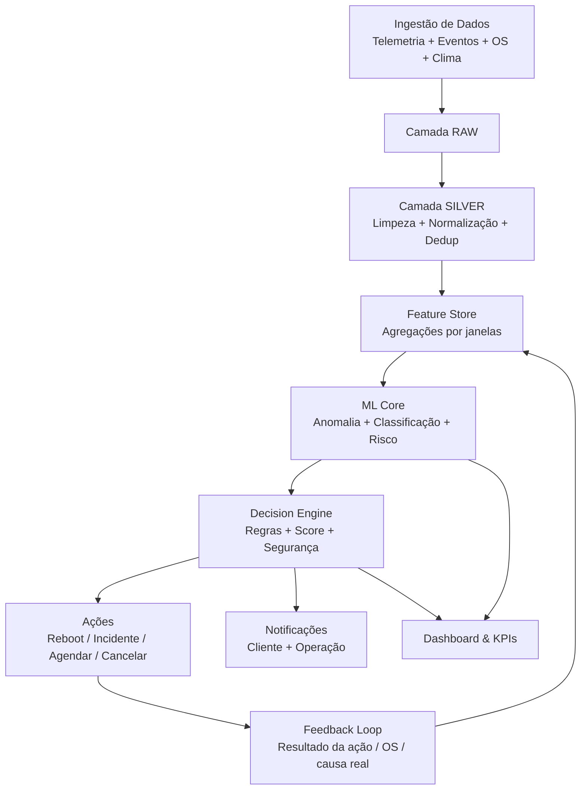
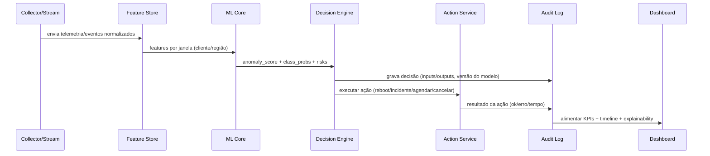

# AI Network Guardian
**Plataforma de IA para prever, diagnosticar e resolver falhas de conectividade — reduzindo custos operacionais e melhorando SLA.**

> **O que este projeto faz:** monitora telemetria e eventos de rede, detecta anomalias, classifica causa provável (massiva vs individual), prevê risco de falha (2h/6h/24h), recomenda/aciona ações (reboot/abrir incidente/agendar/cancelar) e exibe tudo em um dashboard com métricas de economia.

---

## Sumário
- [Visão geral](#visão-geral)
- [Principais funcionalidades](#principais-funcionalidades)
- [Arquitetura](#arquitetura)
- [Fluxogramas](#fluxogramas)
- [Modelos de IA](#modelos-de-ia)
- [Decision Engine (Autopilot)](#decision-engine-autopilot)
- [Estrutura do repositório](#estrutura-do-repositório)
- [Banco de dados](#banco-de-dados)
- [API](#api)
- [Dashboard](#dashboard)
- [Métricas e economia](#métricas-e-economia)
- [Como rodar localmente](#como-rodar-localmente)
- [Roadmap](#roadmap)
- [Segurança, auditoria e observabilidade](#segurança-auditoria-e-observabilidade)
- [Licença](#licença)

---

## Visão geral
No fluxo tradicional de ISP/telecom:
1. Cliente perde sinal → 2. Cliente reclama/abre chamado → 3. Agenda técnico → 4. Custo alto + fricção.

O **AI Network Guardian** antecipa o problema:
- detecta degradação antes da queda completa,
- separa **queda massiva** de problema **individual**,
- aciona **auto-correção** (com limites de segurança),
- comunica o cliente com clareza,
- agenda visita só quando necessário,
- cancela agendamentos se a instabilidade se resolver,
- mede **economia** e melhora de **SLA/MTTR**.

---

## Principais funcionalidades
### Monitoramento & Inteligência
- **Ingestão** (batch ou near real-time) de:
  - telemetria (RX/TX/SNR/BER/CRC, latência, perda de pacote),
  - status de CPE/ONU (online/offline, uptime, reboot_count),
  - eventos (PPPoE/DHCP down, alarmes, logs),
  - contexto (região/OLT/caixa/vizinhos, clima, histórico de OS/chamados).
- **Feature Store** com agregações por janelas (5/15/60 min, 24h, 7d, 30d).
- **Detecção de anomalias** para degradação (sem rótulo).
- **Classificação** de causa provável (massiva vs individual + categorias).
- **Previsão de risco** de falha por horizonte (2h/6h/24h).

### Ações automáticas (com segurança)
- Reboot controlado (rate-limit + cooldown).
- Abertura de incidente massivo (NOC).
- Pausa/cancelamento de agendamentos em regiões massivas.
- Agendamento inteligente para casos persistentes.
- Notificação ao cliente (WhatsApp/SMS/e-mail — mockável).

### Operação & Gestão
- **Dashboard** com:
  - fila de clientes em risco,
  - mapa/heatmap por região/OLT/caixa,
  - incidentes massivos ativos (timeline),
  - auditoria de decisões (por quê a IA decidiu),
  - economia estimada (R$), OS evitadas, SLA, MTTR.
- **Observabilidade**: logs estruturados, métricas, tracing (opcional).
- **Auditoria**: versionamento do modelo, inputs/outputs de decisão e trilha de eventos.

---

## Arquitetura
> **Sugestão de stack (adaptável):**
- Data/ETL: **Python** (pandas, pydantic), jobs + scheduler
- Stream/Queue: **Redis Streams** / RabbitMQ / Kafka (opcional)
- DB: **PostgreSQL** (analytics) + MySQL (operacional) *(ou um só, bem modelado)*
- API: **FastAPI** (Python) ou **Node** / **Laravel**
- ML: scikit-learn / lightgbm / xgboost + MLflow (opcional)
- Dashboard: **React** + Tailwind
- Observabilidade: Prometheus/Grafana + OpenTelemetry (opcional)

---

## Fluxogramas

### 1) Fluxo macro (end-to-end)


### 2) Fluxo de decisão (massiva vs individual)
```mermaid
flowchart TD
  S[Evento/Telemetria: cliente offline ou sinal degradando] --> F1[Calcular features]
  F1 --> M1[Modelo: Anomalia]
  F1 --> M2[Modelo: Classificação de Causa]
  F1 --> M3[Modelo: Risco 2h/6h/24h]
  M2 -->|Massiva prob alta| X1[Verificar vizinhos/cluster (OLT/caixa)]
  X1 -->|Cluster alto| A1[Abrir Incidente Massivo + Pausar OS na área]
  X1 -->|Cluster baixo| I1[Tratar como individual]
  M2 -->|Individual| I1[Tratar como individual]
  I1 --> R1{Pode tentar auto-correção?}
  R1 -->|Sim| B1[Reboot 1x (cooldown)]
  R1 -->|Não| T1[Agendar técnico]
  B1 --> V1{Voltou e estabilizou 30min?}
  V1 -->|Sim| C1[Fechar caso + evitar OS]
  V1 -->|Não| T1[Agendar técnico]
```

### 3) Sequência (tempo real) — monitoramento → ação → auditoria


### 4) Arquitetura de componentes
```mermaid
flowchart LR
  subgraph DataSources[Fontes de Dados]
    S1[Telemetria CPE/ONU]
    S2[Eventos Rede/OLT]
    S3[Chamados/OS/Agenda]
    S4[Clima/Externo]
  end

  subgraph Ingestion[Ingestão]
    C1[Collectors (Python)]
    Q1[(Queue/Stream)]
  end

  subgraph Storage[Armazenamento]
    R[(RAW)]
    SI[(SILVER)]
    FS[(Feature Store)]
    OLTP[(DB Operacional)]
    ANA[(DB Analytics)]
  end

  subgraph Intelligence[IA]
    ML[ML Core]
    DR[Drift Monitor (opcional)]
    REG[Model Registry (opcional)]
  end

  subgraph Decision[Decisão]
    DE[Decision Engine]
    AS[Action Service]
    NS[Notification Service]
    AL[Audit Log]
  end

  subgraph Product[Produto]
    API[API Gateway]
    UI[Dashboard React]
  end

  S1-->C1
  S2-->C1
  S3-->C1
  S4-->C1
  C1-->Q1
  Q1-->R
  R-->SI
  SI-->FS
  SI-->OLTP
  FS-->ML
  ML-->DE
  DE-->AS
  DE-->NS
  DE-->AL
  AS-->AL
  NS-->AL
  API-->OLTP
  API-->ANA
  UI-->API
  AL-->ANA
  DR-->ML
  REG-->ML
```

---

## Modelos de IA
> Você pode começar simples (MVP) e evoluir.

### A) Detecção de anomalias (sem rótulo)
**Objetivo:** identificar degradação do comportamento do sinal antes da queda completa.  
Opções:
- Isolation Forest / One-Class SVM
- Autoencoder (se tiver volume de dados)

**Saída:** `anomaly_score` (0–1)

### B) Classificação de causa provável
**Objetivo:** separar **massiva vs individual** e indicar causa provável.
- LightGBM/XGBoost (tabular)
- Regras de cluster como reforço (vizinhos offline)

Classes sugeridas:
- `MASSIVE_OUTAGE`
- `CUSTOMER_PREMISES`
- `EQUIPMENT_FAIL`
- `EXTERNAL_NETWORK`
- `INTERMITTENT`
- `UNKNOWN`

**Saída:** probabilidade por classe (`class_probs`)

### C) Previsão de risco por horizonte
**Objetivo:** prever probabilidade de falha nas próximas:
- 2h, 6h, 24h

**Saídas:** `risk_2h`, `risk_6h`, `risk_24h`

### D) Recomendação / otimização (custo esperado) — diferencial
**Objetivo:** escolher ação que minimiza custo esperado e MTTR.
- MVP: regras + score
- Avançado: bandit/RL leve (opcional)

**Saída:** `action` + `expected_savings` + `expected_resolution_time`

---

## Decision Engine (Autopilot)
O Autopilot decide com base em:
- outputs dos modelos,
- contexto (cliente VIP, SLA, reincidência),
- segurança (rate-limits),
- custo esperado.

### Regras base (exemplo)
- Se `MASSIVE_OUTAGE prob > 0.8` e vizinhos_offline alto → **abrir incidente massivo** + **pausar OS** na área.
- Se individual e risco alto → notificar cliente + tentar **reboot** (1x por 6h).
- Se voltar e estabilizar 30 min → fechar caso e **evitar OS**.
- Se persistir → **agendar visita** com prioridade.
- Se existe OS e virar massiva → **cancelar visita** e avisar.

### Auditoria (obrigatório para “nível empresa”)
Cada decisão registra:
- timestamp,
- inputs (features agregadas + scores),
- outputs (ação + confiança),
- versão do modelo,
- resultado da ação (ok/erro/duração).

---

## Estrutura do repositório
```text
ai-network-guardian/
├─ apps/
│  ├─ api/                 # FastAPI/Node/Laravel (escolha)
│  └─ dashboard/           # React
├─ services/
│  ├─ collectors/          # ingestão (batch/stream)
│  ├─ feature-store/       # agregações e materialização
│  ├─ ml-core/             # treino + inferência
│  ├─ decision-engine/     # regras + custo esperado
│  ├─ action-service/      # reboot/incidente/agendar/cancelar
│  └─ notification-service/# whatsapp/email (mock)
├─ infra/
│  ├─ docker/              # docker-compose, configs
│  └─ migrations/          # schema SQL
├─ docs/
│  ├─ architecture.md
│  ├─ playbooks.md
│  └─ datasets.md
├─ notebooks/              # exploração/EDA (opcional)
├─ README.md
└─ LICENSE
```

---

## Banco de dados
> **Modelo mínimo recomendado (simplificado)**

### Tabelas principais
- `telemetry_raw(id, customer_id, ts, metric, value, source)`
- `events_raw(id, ts, type, severity, payload_json)`
- `customers(customer_id, plan, city, region, segment, created_at)`
- `service_orders(os_id, customer_id, status, reason, region, opened_at, closed_at, technician_id)`
- `incidents(incident_id, scope_key, scope_type, start_at, end_at, severity, affected_customers)`
- `features_timeseries(customer_id, window_start, window_end, f1..fn)`
- `ml_predictions(pred_id, customer_id, ts, anomaly_score, class_probs_json, risk_2h, risk_6h, risk_24h, model_version)`
- `decisions(decision_id, customer_id, ts, action, confidence, rationale_json, model_version)`
- `actions(action_id, decision_id, action_type, status, started_at, finished_at, result_json)`
- `notifications(notification_id, customer_id, ts, channel, template, status, metadata_json)`

---

## API
### Endpoints sugeridos
- `GET /health`
- `GET /customers/:id/timeline`
- `GET /risk?region=...&window=...`
- `GET /incidents/active`
- `POST /decision/simulate` (não executa, só recomenda)
- `POST /decision/execute` (executa com validações)
- `GET /metrics/kpis` (economia, SLA, MTTR, OS evitadas)

---

## Dashboard
### Telas principais
1. **NOC Overview**
   - incidentes massivos ativos
   - heatmap por região/OLT/caixa
   - timeline de eventos
2. **Fila de Risco**
   - top clientes por `risk_2h`
   - filtros (região, plano, VIP, reincidência)
3. **Dossiê do Cliente**
   - telemetria recente
   - decisões + auditoria
   - ações executadas + resultado
4. **KPIs & Economia**
   - OS evitadas
   - economia estimada (R$)
   - MTTR, SLA, taxa de falso positivo
5. **Explainability**
   - top features que influenciaram decisão (SHAP opcional)

---

## Métricas e economia
### KPIs operacionais
- **Precision/Recall** de massiva vs individual
- **MTTR** (tempo médio para restaurar)
- **SLA** por região
- Taxa de reboot bem-sucedido
- Taxa de cancelamento de OS por normalização

### Economia estimada (modelo simples)
- `economia = OS_evitadas * custo_medio_visita`
- `custo_medio_visita` parametrizável (ex: R$ 120–200)

### Exemplo de painel
- “Este mês: **312 OS evitadas** → **R$ 46.800** economizados”
- “MTTR caiu de 2h15 para 1h40 em regiões monitoradas”

---

## Como rodar localmente
> Abaixo é um template. Ajuste conforme sua stack escolhida.

### Pré-requisitos
- Docker + Docker Compose
- Python 3.11+ (se usar FastAPI/ML em Python)
- Node 18+ (dashboard React)

### Variáveis de ambiente (exemplo)
Crie `.env` na raiz:
```env
# DB
DB_HOST=localhost
DB_PORT=5432
DB_NAME=guardian
DB_USER=guardian
DB_PASS=guardian

# Redis / Queue (opcional)
REDIS_URL=redis://localhost:6379

# Segurança
JWT_SECRET=change-me
AUTOPILOT_MODE=simulate  # simulate | execute
REBOOT_COOLDOWN_MINUTES=360
MAX_REBOOTS_PER_DAY=2

# Custos para cálculo de economia
COST_PER_VISIT=150

# Notificações (mock/real)
WHATSAPP_PROVIDER=mock
```

### Subir infra (exemplo)
```bash
docker compose -f infra/docker/docker-compose.yml up -d
```

### Rodar API (exemplo FastAPI)
```bash
cd apps/api
python -m venv .venv
# Linux/Mac:
source .venv/bin/activate
# Windows:
# .venv\Scripts\activate
pip install -r requirements.txt
uvicorn main:app --reload --port 8000
```

### Rodar Dashboard
```bash
cd apps/dashboard
npm install
npm run dev
```

---

## Roadmap
### Fase 1 (MVP forte)
- Ingestão + camadas RAW/SILVER
- Feature Store básico
- Anomalia + classificação simples
- Decision Engine por regras (simulação)
- Dashboard: fila + incidentes + auditoria

### Fase 2 (nível contratação)
- Previsão risco 2h/6h/24h
- Economia estimada e KPIs completos
- Explainability (top features)
- Feedback loop (resultado da OS melhora o modelo)

### Fase 3 (produto)
- Integrações reais (reboot/WhatsApp)
- Drift monitoring + versionamento (MLflow)
- Otimização de fila/agendamento por custo esperado

---

## Segurança, auditoria e observabilidade
- **Rate limits**: evitar ações repetidas (ex.: reboot) causando instabilidade.
- **Modo simulação**: recomendado para validação inicial.
- **Auditoria completa**: decisão + rationale + versão do modelo + resultado da ação.
- **Logs estruturados** (JSON), métricas (Prometheus) e dashboards (Grafana) — opcional.

---

## Licença
Escolha uma:
- MIT (mais aberta)
- Apache 2.0 (boa para projetos “enterprise-like”)
