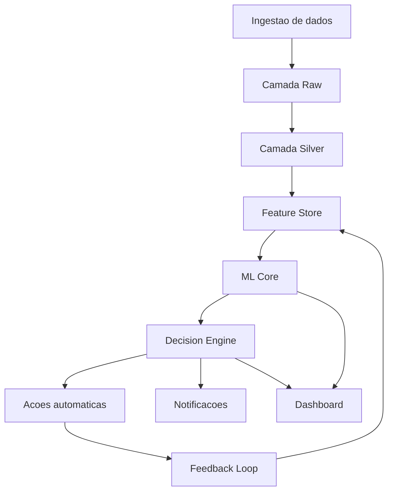
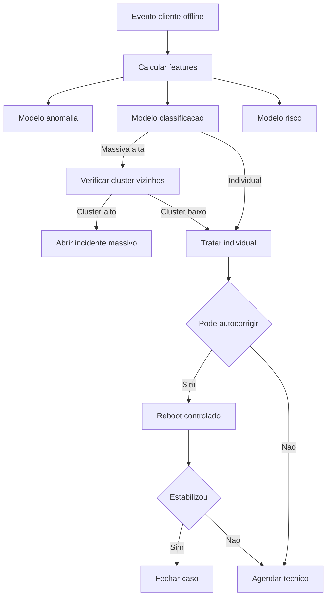
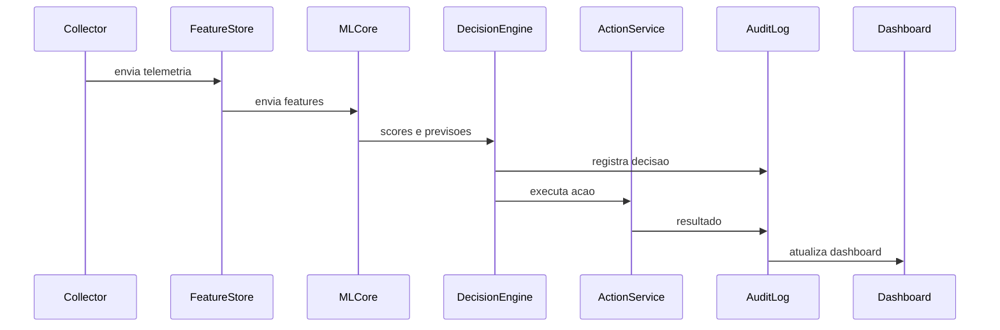
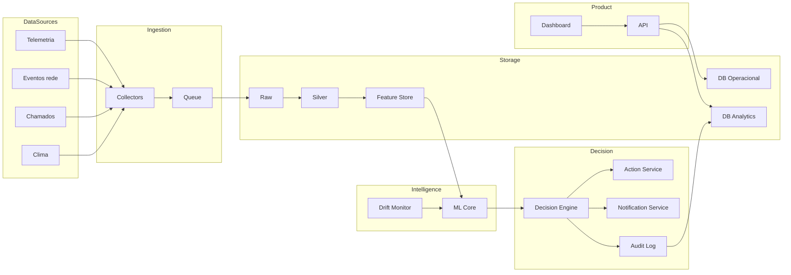

# AI Network Guardian
**Plataforma de IA para prever, diagnosticar e resolver falhas de conectividade — reduzindo custos operacionais e melhorando SLA.**

> O que este projeto faz: monitora telemetria e eventos de rede, detecta anomalias, classifica causa provável (massiva vs individual), prevê risco de falha (2h/6h/24h), recomenda ou executa ações (reboot, abrir incidente, agendar ou cancelar visita) e exibe tudo em um dashboard com métricas de economia operacional.

---

## Sumário
- [Visão geral](#visao-geral)
- [Principais funcionalidades](#principais-funcionalidades)
- [Arquitetura](#arquitetura)
- [Fluxogramas](#fluxogramas)
- [Modelos de IA](#modelos-de-ia)
- [Decision Engine](#decision-engine)
- [Estrutura do repositório](#estrutura-do-repositorio)
- [Banco de dados](#banco-de-dados)
- [API](#api)
- [Dashboard](#dashboard)
- [Métricas e economia](#metricas-e-economia)
- [Como rodar localmente](#como-rodar-localmente)
- [Roadmap](#roadmap)
- [Segurança e auditoria](#seguranca-e-auditoria)
- [Licença](#licenca)

---

## Visao geral

No fluxo tradicional de ISP:

1. Cliente perde sinal  
2. Cliente abre chamado  
3. Agenda técnico  
4. Alto custo operacional

O **AI Network Guardian** antecipa o problema:

- detecta degradação antes da queda completa
- separa queda massiva de problema individual
- executa auto correção quando possível
- comunica o cliente automaticamente
- agenda visita apenas quando necessário
- cancela visitas quando o problema normaliza
- mede economia e melhora de SLA e MTTR

---

## Principais funcionalidades

### Monitoramento e Inteligência
- Ingestão de dados em batch ou near real time:
  - telemetria de sinal
  - status de ONU ou modem
  - eventos de rede
  - histórico de chamados e OS
  - contexto de região e vizinhos
  - clima

- Feature Store com agregações:
  - janelas de 5, 15 e 60 minutos
  - histórico diário e semanal

- Detecção de anomalias
- Classificação de causa provável
- Previsão de risco de falha

### Ações automáticas
- reboot controlado
- abertura de incidente massivo
- pausa de agendamentos em regiões afetadas
- agendamento inteligente
- notificação ao cliente

### Operação e gestão
Dashboard com:
- fila de clientes em risco
- heatmap por região
- incidentes ativos
- auditoria das decisões da IA
- economia estimada
- métricas de SLA e MTTR

---

## Arquitetura

Stack sugerida:

- Data e ETL: Python
- Stream: Redis Streams ou RabbitMQ
- Banco: PostgreSQL ou MySQL
- API: FastAPI ou Laravel
- ML: scikit-learn, LightGBM ou XGBoost
- Frontend: React + Tailwind

---

## Fluxogramas

### 1) Fluxo geral



---

### 2) Fluxo de decisao



---

### 3) Sequencia monitoramento


---

### 4) Arquitetura de componentes



---

## Modelos de IA

### Detecção de anomalia
- Isolation Forest
- One Class SVM

Saída:
```
anomaly_score
```

### Classificação
- LightGBM ou XGBoost

Classes:
- MASSIVE_OUTAGE
- CUSTOMER_PREMISES
- EQUIPMENT_FAIL
- EXTERNAL_NETWORK
- INTERMITTENT

### Previsão de risco
Saídas:
```
risk_2h
risk_6h
risk_24h
```

---

## Decision Engine

Decide baseado em:
- resultados dos modelos
- contexto do cliente
- regras de segurança
- custo esperado

Exemplo:
- massiva detectada → abrir incidente
- individual → tentar reboot
- estabilizou → cancelar OS
- persistiu → agendar visita

Todas decisões são auditadas.

---

## Estrutura do repositorio

```
ai-network-guardian/
├─ apps/
│  ├─ api/
│  └─ dashboard/
├─ services/
│  ├─ collectors/
│  ├─ feature-store/
│  ├─ ml-core/
│  ├─ decision-engine/
│  ├─ action-service/
│  └─ notification-service/
├─ infra/
├─ docs/
├─ notebooks/
└─ README.md
```

---

## Banco de dados

Tabelas principais:

- telemetry_raw
- events_raw
- customers
- service_orders
- incidents
- features_timeseries
- ml_predictions
- decisions
- actions
- notifications

---

## API

Endpoints:

```
GET /health
GET /customers/:id/timeline
GET /risk
GET /incidents/active
POST /decision/simulate
POST /decision/execute
GET /metrics/kpis
```

---

## Dashboard

Telas:
- NOC Overview
- Fila de risco
- Dossie do cliente
- KPIs e economia
- Explainability

---

## Metricas e economia

KPIs:
- Precision e Recall
- MTTR
- SLA
- OS evitadas

Economia:
```
economia = OS_evitadas * custo_medio_visita
```

---

## Como rodar localmente

Pré requisitos:
- Docker
- Python 3.11
- Node 18

### Subir infra
```
docker compose up -d
```

### API
```
cd apps/api
pip install -r requirements.txt
uvicorn main:app --reload
```

### Dashboard
```
cd apps/dashboard
npm install
npm run dev
```

---

## Roadmap

### Fase 1
- ingestao
- feature store
- anomalia
- dashboard basico

### Fase 2
- previsao risco
- explainability
- economia estimada

### Fase 3
- integracoes reais
- monitoramento de drift
- otimizacao de agendamento

---

## Seguranca e auditoria
- rate limit de acoes
- modo simulacao
- auditoria completa das decisoes

---

## Licenca
MIT ou Apache 2.0
